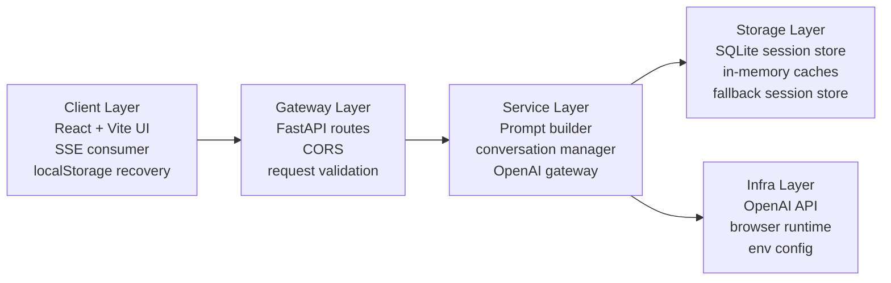

# Ori Stress Check-In

Ori Stress Check-In is a guided 5-step wellbeing prototype. It walks a user through a short reflection with Ori, streams each question into the browser in real time, and finishes with a structured stress profile plus three grounded next steps.

## Tech Stack

### Frontend

- React
- Vite
- fetch-based SSE client for chat streaming
- Axios for non-streaming API calls
- localStorage for browser recovery and browser-scoped `client_id`

### Backend

- Python
- FastAPI
- Pydantic
- `httpx`
- `python-dotenv`

### LLM

- OpenAI Chat Completions API
- default model: `gpt-5.2-chat-latest`

### Storage and Caching

- SQLite for durable session, message, and report persistence
- in-memory active-session cache for hot conversation reads
- in-memory history cache for recent sidebar lookups
- in-memory fallback store if SQLite becomes unavailable

## Setup

### Backend

```bash
cd backend
python3 -m venv .venv
source .venv/bin/activate
pip install -r requirements.txt
uvicorn src.main:app --reload
```

The backend loads `backend/.env` automatically. A minimal local config looks like this:

```env
OPENAI_API_KEY=your_api_key_here
OPENAI_MODEL=gpt-5.2-chat-latest
ORI_DB_PATH=data/ori.sqlite3
```

You can start from [backend/.env.example](/Users/vedantchak/Desktop/resume/backend/.env.example).

If you prefer shell env vars instead of a `.env` file:

```bash
export OPENAI_API_KEY="your_api_key_here"
export OPENAI_MODEL="gpt-5.2-chat-latest"
export ORI_DB_PATH="data/ori.sqlite3"
```

### Frontend

```bash
cd frontend
npm install
npm run dev
```

Optional frontend API override:

```bash
export VITE_API_BASE_URL="http://127.0.0.1:8000"
```

## Local URLs

- Frontend: `http://127.0.0.1:5173`
- Backend: `http://127.0.0.1:8000`
- Health check: `http://127.0.0.1:8000/health`

## API Surface

- `POST /chat`
- `POST /report`
- `GET /history/{client_id}`
- `GET /history/{client_id}/{session_id}`
- `DELETE /history/{client_id}/{session_id}`
- `DELETE /history/{client_id}`
- `GET /health`

## What Was Built And Why

- A guided 5-step stress reflection where Ori asks one question per turn.
- Real-time SSE streaming so Ori’s messages appear incrementally instead of all at once.
- Server-side step detection based on assistant turns, so the backend stays authoritative.
- A final structured report with:
  - `stress_style`
  - `primary_stressor`
  - `body_signals`
  - `coping_pattern`
  - `support_need`
  - three action recommendations
- A browser-based UI with:
  - progress tracking
  - saved session history
  - session rehydration into the right panel
  - delete-one and clear-all history controls
- SQLite-backed persistence so finished reflections survive backend restarts.
- In-memory cache layers so active sessions and recent history stay fast.
- Automatic in-memory fallback so the app still works if SQLite fails.

The product choice was a stress check-in because it maps naturally to a short multi-step LLM interaction: it is focused, emotionally useful, easy to complete in one sitting, and produces a meaningful end result without needing a long session.

## Decision Rationale

### Why React + Vite

- Fast local iteration for a UI-heavy prototype.
- Simple component model for chat, progress, report, and history surfaces.
- Good fit for incremental streaming updates in state.

### Why FastAPI

- Clean typed route definitions with Pydantic validation.
- Lightweight setup for a prototype that still reads like production code.
- Easy SSE support for chat streaming.

### Why OpenAI Chat Completions

- Straightforward streaming support for token-by-token chat delivery.
- Good fit for both conversational prompting and structured report generation.
- Easy to wrap in a single gateway with retry and fallback behavior.

### Why SQLite

- Durable local persistence with zero external setup.
- Good enough for short, low-volume prototype sessions.
- Easier for reviewers to run than Postgres in a take-home exercise.

### Why in-memory caches on top of SQLite

- Active chat sessions are read often and should not hit disk every time.
- Sidebar history benefits from a short-lived cache because it is revisited frequently.
- The storage boundaries are isolated, so Redis can replace these caches later.

### Why browser `client_id` plus per-check-in `session_id`

- `client_id` lets one browser load its own past reflections without adding auth.
- `session_id` keeps each check-in independently reloadable and deletable.
- This keeps the prototype lightweight while still supporting history.

### Why server-side step detection

- Prevents the client from skipping or misreporting progress.
- Makes refresh recovery and session reloads safer.
- Keeps the guided flow rules in one place on the backend.

## Exact Data Flow

### 1. Chat turn flow: `POST /chat`

1. The React app sends `client_id`, `session_id`, and the current messages to FastAPI.
2. FastAPI validates the body with Pydantic.
3. `conversation.py` validates turn alternation and the 20-message cap.
4. `storage.py` loads the current session state from:
   - active in-memory cache first
   - SQLite second
   - in-memory fallback store if the DB is unavailable
5. `conversation.py` detects the current step from assistant turns.
6. `prompts.py` builds the step-aware system prompt for Ori.
7. `llm.py` sends the request to OpenAI and streams tokens back through SSE.
8. FastAPI emits:
   - `meta`
   - `token`
   - `done`
   events to the browser.
9. When streaming finishes, the assistant reply is persisted through `storage.py`.

### 2. Report flow: `POST /report`

1. The frontend sends the completed transcript with `client_id` and `session_id`.
2. FastAPI validates the request.
3. `conversation.py` checks that the fifth user answer is present.
4. `conversation.py` builds a plain transcript string for report generation.
5. `llm.py` requests structured JSON from OpenAI.
6. If the model returns malformed JSON, `llm.py` retries once with a repair prompt.
7. The final report is stored through `storage.py` and marked as a completed session.

### 3. History list flow: `GET /history/{client_id}`

1. The frontend requests recent saved sessions for the current browser.
2. FastAPI calls `recent_session_history()`.
3. `storage.py` checks the short-lived history cache first.
4. On cache miss, it reads from SQLite.
5. If SQLite is unavailable, it reads from the in-memory fallback store.
6. The frontend renders completed sessions in the left sidebar.

### 4. History detail flow: `GET /history/{client_id}/{session_id}`

1. The user clicks a saved history card.
2. The frontend requests the full saved session detail.
3. FastAPI loads the full message thread and saved report.
4. `storage.py` enforces ownership using `client_id`.
5. The frontend hydrates the right panel with the saved conversation and final report.

### 5. Delete one session flow: `DELETE /history/{client_id}/{session_id}`

1. The user clicks `Delete` on a saved history card.
2. The frontend calls the delete endpoint for that session.
3. `storage.py` deletes the record from SQLite if the DB is available.
4. The same session is also removed from in-memory caches and fallback memory.
5. The sidebar refreshes.
6. If the deleted session was currently open, the app starts a fresh Ori check-in automatically.

### 6. Clear all history flow: `DELETE /history/{client_id}`

1. The user clicks `Clear all` in the history section.
2. The frontend requests bulk deletion for that browser `client_id`.
3. `storage.py` removes matching sessions from SQLite and in-memory stores.
4. The sidebar refreshes to an empty completed-history state.
5. If the active view was a completed saved session, the app resets into a fresh check-in.

### 7. Persistence failover flow

1. On startup, the backend attempts to initialize SQLite.
2. If initialization fails, the backend stays up and disables DB usage.
3. If a later DB read or write fails, the backend disables DB usage at that point.
4. After failover, active chat, report generation, history reads, and detail reads continue from the in-memory fallback store for the current process.

## Module Breakdown

- `backend/src/main.py`: FastAPI app, routes, middleware, SSE response wiring
- `backend/src/conversation.py`: turn validation, step detection, transcript preparation, history actions
- `backend/src/prompts.py`: pure prompt generation for chat and report modes
- `backend/src/llm.py`: OpenAI gateway, streaming, retries, report repair, env resolution
- `backend/src/db.py`: SQLite path resolution and schema initialization
- `backend/src/storage.py`: durable persistence, cache reads, fallback storage, delete flows
- `backend/src/models.py`: typed request and response contracts
- `frontend/src/hooks/useChat.js`: browser state, streaming, history hydration, delete actions
- `frontend/src/api.js`: REST and SSE client calls
- `frontend/src/components/*`: chat UI, progress, report, and history presentation

## What Was Explicitly Not Built And Why

- Authentication was skipped to keep the prototype focused on the guided wellbeing flow rather than account management.
- Postgres and Redis were skipped in favor of SQLite plus in-process caching so the app stays easy to run locally.
- PDF export was skipped because the value here is the guided reflection and actionable summary, not document generation.
- Docker was skipped to keep the submission lightweight and fast to boot.
- A formal automated test suite was skipped so time could go into the actual interaction, LLM integration, persistence, and UI polish.

## One Thing To Improve With More Time

- Replace the local SQLite plus in-memory cache design with Postgres plus Redis-backed shared state, then add observability around model latency, retry rates, cache hit rates, and report-generation failures.

## Architecture Diagram



## Verification

- `./.venv/bin/python -m compileall src`
- `npm run build`
- live `GET /health`
- live 5-step `/chat` flow through the real OpenAI path
- live `POST /report`
- live `GET /history/{client_id}`
- live `GET /history/{client_id}/{session_id}`
- live `DELETE /history/{client_id}/{session_id}`
- live `DELETE /history/{client_id}`
- live `409` check for requesting a report too early
- live `400` check for invalid non-alternating turns
- live `429` check for exceeding the 20-message cap
- persistence check across backend restart
- DB-fallback smoke test with SQLite intentionally disabled
